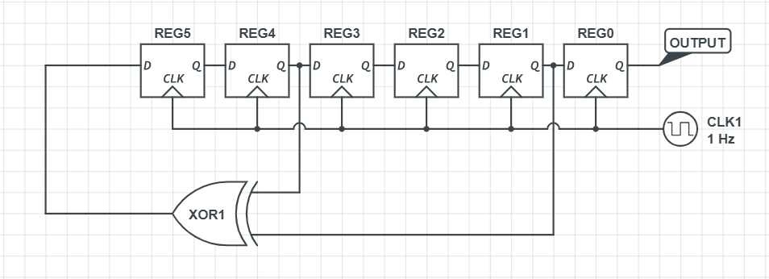

# Shifty Boi
Hardware

## Challenge 

Seed: 6'b111111 Hint: {0xbc, 0x1c, 0x56, 0x06, 0xab, 0xb5, 0x61, 0xa0, 0xe2, 0x8b, 0x55, 0xed, 0x74, 0xdd, 0x2f, 0x60}

made by Ed Krawczyk.

## Solution

Linear Feedback Shift Register

Since 6 registers are used, the combined bits cannot be used to form a XOR cipher.

The output from REG0 is used to make the bitstream. For every 8 shifts, we get a byte from the output. This is then used using XOR cipher with the hint.

I implemented a Shift Register in C and then did an XOR cipher with the hint.

[solve.c](solve.c)

Running the code.

	$ gcc solve.c -o sol && ./sol 
	-01-03-07-0f-1f-3f-3f-3f-> 0x5f = _ 
	-01-03-03-0b-0b-0b-4b-4b-> 0x64 = d 
	-00-00-00-08-08-28-28-a8-> 0x75 = u 
	-01-03-03-0b-1b-1b-1b-1b-> 0x6f = o 
	-01-03-07-0f-1f-1f-1f-9f-> 0x72 = r 
	-01-01-05-05-05-25-25-25-> 0x70 = p 
	-00-00-04-04-14-14-54-d4-> 0x5f = _ 
	-01-01-05-0d-0d-0d-0d-8d-> 0x6f = o 
	-01-03-07-0f-0f-0f-4f-cf-> 0x6f = o 
	-00-02-02-02-12-12-12-12-> 0x73 = s 
	-00-02-02-0a-0a-2a-6a-ea-> 0x5f = _ 
	-00-02-06-06-06-06-46-c6-> 0x6d = m 
	-01-03-07-07-07-27-67-67-> 0x61 = a 
	-01-01-01-09-09-09-09-09-> 0x5f = _ 
	-01-01-05-05-15-35-75-75-> 0x69 = i 
	-01-03-03-03-03-23-63-e3-> 0x5f = _ 
	Flag = _i_am_soo_proud_

## Flag

	WPI{i_am_soo_proud}
